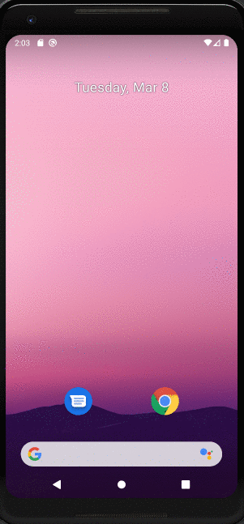

*NY Times Bestselling Books*

**NY Times Bestselling Books** is an android app that allows a user to view his the current weeks New York Times best selling books. The app utilizes [NY Time REST API](https://developer.nytimes.com/).

<!-- 
## User Stories

The following functionality are implemented:

The following **optional** features are implemented:

The following **additional** features are implemented:

- [ ] List anything else that you can get done to improve the app functionality!
 -->
## Video Walkthrough

Here's a walkthrough of implemented user stories:

GIF created with [Recordit](https://recordit.co/).

## Notes

This is the starter code for lab 1, see [Android University Course - Lab 1](https://courses.codepath.org/courses/android_university/unit/1#!exercises) for additional instructions.

Notes used:
https://guides.codepath.org/android/Constructing-View-Layouts
https://guides.codepath.org/android/Working-with-the-TextView
https://guides.codepath.org/android/Defining-Views-and-their-Attributes

## Open-source libraries used

- [Retrofit](https://github.com/square/retrofit) - This is a commonly used industry level networking library
- [Glide](https://github.com/bumptech/glide) - Image loading and caching library for Android